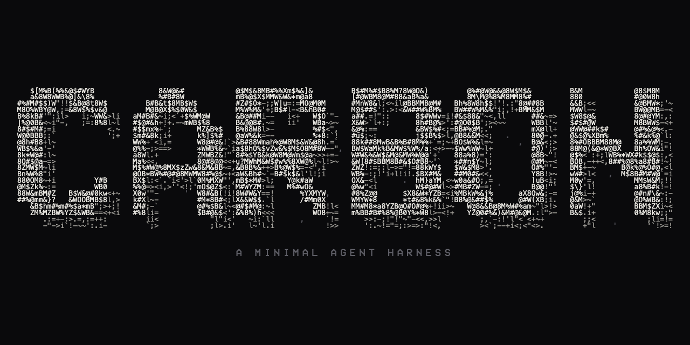

# carbon

A minimal agent harness: a headless agent loop, four tools, and file-based
sessions. The foundation you build other agents on.

## Why this exists

Every useful agent starts as a coding agent. Bash plus a filesystem is the
universal tool, so anything an agent needs to do reduces to reading files,
writing files, and running commands. Build that foundation once, understand
every layer of it, and future agents become mounts on top of it rather than
fresh rewrites.

carbon is that foundation, and it is small on purpose. The interesting
decisions are not in the loop (the loop is a few hundred lines). They are in
the boundaries:

- **Headless core.** `@carbon/core` never touches stdin or stdout. The `Agent`
  yields a stream of typed events; a *mount* (a terminal REPL, an HTTP server,
  a cron job) consumes them and owns all I/O, including how it asks the user to
  approve a tool call. A new agent is a new mount, not a fork of the loop.
- **Tools are data, not a plugin system.** A tool is a name, a description, an
  input schema, and a function. You pass tools to the agent as plain values.
  Extension is an import, not a registry.
- **Transcripts are files.** Every session is append-only JSONL on disk. Cheap
  to write, trivial to replay, and the raw material for memory and compaction.
- **Mechanism, not policy.** The core enforces *that* a risky tool needs
  approval and *that* memory can be mounted. It has no opinion on *how* you
  approve or *what* you store. Those are the consumer's decisions.

The throughline is that the opinions are the product. carbon exists so that
every agent decision (context, memory, tools, permissions, visibility) is a
first-class design choice instead of a workaround.

## What's in it

- **`@carbon/core`** the harness. The agent loop, the four tools (bash, read,
  write, edit), a subagent tool, JSONL sessions, memory loading, and
  client-side compaction. No I/O, no rendering.
- **`@carbon/cli`** the first mount. A terminal REPL with streamed output,
  tool-permission prompts, interrupt handling, and session resume.
- **`@carbon/server`** a second mount. An HTTP + SSE server, built to prove the
  core boundary holds. It required zero changes to the core.

Full architecture and the milestone history are in [SPEC.md](./SPEC.md).

## Quickstart

Needs [Bun](https://bun.sh). Auth resolves the same way the Anthropic SDK does:
set `ANTHROPIC_API_KEY`, or log in with a profile.

```sh
bun install
cd packages/cli && bun link   # puts `carbon` on your PATH
```

Then run it inside any project folder:

```sh
carbon                         # interactive session in the current directory
carbon -p "what does this repo do?"   # one-shot
carbon -c                      # resume the most recent session
carbon --memory ~/.carbon-memory      # mount a persistent memory directory
```

Ctrl+C during a run interrupts the current turn and leaves the conversation
usable; at the idle prompt it exits. Sessions are append-only JSONL, so
`carbon -c` always resumes exactly where you were.

## Other providers

carbon targets the Anthropic Messages API, so it also runs against any
Anthropic-compatible endpoint. Point it at one with `ANTHROPIC_BASE_URL` and the
matching key, then pick the model. This is how you run it on a cheaper model
than Opus. Example with Kimi (Moonshot):

```sh
export ANTHROPIC_BASE_URL=https://api.moonshot.ai/anthropic
export ANTHROPIC_API_KEY=<your moonshot key>
export CARBON_MODEL=kimi-k2.7-code
export CARBON_NO_THINKING=1   # this model doesn't accept the thinking param
carbon
```

`CARBON_MODEL`, `CARBON_NO_THINKING`, and `CARBON_NO_CACHE` set the defaults once
so you don't retype flags. Per-run, the same knobs are `-m <model>`,
`--no-thinking`, and `--no-cache`. Use `--no-thinking` for any endpoint or model
that rejects the thinking parameter, and `--no-cache` for one that rejects
`cache_control` markers.

## Memory

carbon takes the filesystem-memory position over retrieval-augmented
generation. If a `CARBON.md` exists in the working directory (or anywhere up to
the repo root), its contents are appended to the system prompt as project
instructions. With `--memory <dir>`, the directory's `MEMORY.md` index is
injected at session start and the agent reads and writes memory files with its
ordinary file tools. Memory is grepped and read, not embedded and searched.
What to store and when is the consumer's policy, not the harness's.

## Build on it

The core is a library. A new agent is a new mount that consumes `AgentEvent`s
and supplies its own tools and permission hook.

```ts
import { Agent, coreTools } from "@carbon/core";

const agent = new Agent({ tools: coreTools(), cwd: "/path/to/project" });
for await (const event of agent.run("fix the failing test")) {
  if (event.type === "text") process.stdout.write(event.text);
}
```

## Develop

```sh
bun run typecheck
bun test
```

## How this was built

carbon was designed and directed by me and implemented in close collaboration
with Claude Code. The architecture, the boundaries described above, and the
design decisions are mine; much of the implementation was written by an agent
under that direction, which the commit trailers reflect honestly. Building an
agent harness by directing an agent seemed like the right way to build one.

## License

MIT. See [LICENSE](./LICENSE).
